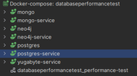

### Prototypes

**Create prototypes for the various possible technologies within our domain.**

_The testing setup can be found [here](https://dev.azure.com/OIBSS-F/Kwetter/_git/DatabasePerformanceTest)_

We focused on implementing C# APIs with different backend databases to explore the core differences between
technologies. Specifically, we chose to test PostgreSQL (Docker), MongoDB (Docker), Neo4j (Docker), and Yugabyte (
hosted). This selection allowed us to assess various database types and their suitability for different parts of the
Kwetter application, while keeping the scope of the research realistic.



For each of the backend databases, we implemented C# APIs with endpoints for essential Kwetter functionalities: create
kweet, update kweet, get kweet by ID, get the most recent 100 kweets, and delete kweet by ID. By implementing the same
functionality across different databases, we ensured consistent testing conditions and the ability to compare their
performance.

To measure the performance of these APIs, we utilized k6, a load testing tool, to execute each action (create, update,
get by ID, get recent kweets, delete) 30.000 times. By measuring the time it took to run the 30.000 requests, we
gathered valuable insights into the performance characteristics of the various databases.


However, it's important to note that the comparison with Yugabyte had certain limitations due to its remote hosted
nature. As the requests had to travel over the network to reach the hosted Yugabyte instance, the additional latency
introduced by network communication became a significant factor. Hence, a direct comparison of response times between
the three local Docker containers and the hosted Yugabyte database would not accurately represent the database's true
performance capabilities. Nonetheless, we can still gain valuable insights into the performance trends and differences
among the databases tested.


By conducting these performance tests and comparing the results, we can draw conclusions about the suitability of each
database for different parts of the Kwetter application. By testing the core features of databases (write, update, read,
delete, search) separately, we can decide what aspect is essential for a certain function of Kwetter, and determine the
best database for that function. This information will help us make informed decisions about which database types to
utilize for specific functionalities within Kwetter, but due to limitations of the test we will still have to consider
factors such as scalability and data modeling requirements.

```json
{
  "openapi": "3.0.1",
  "info": {
    "title": "Mongo",
    "version": "1.0"
  },
  "paths": {
    "/api/Kweet": {
      "get": {
        "tags": [
          "Kweet"
        ],
        "responses": {
          "200": {
            "description": "Success",
            "content": {
              "text/plain": {
                "schema": {
                  "type": "array",
                  "items": {
                    "$ref": "#/components/schemas/KweetDto"
                  }
                }
              },
              "application/json": {
                "schema": {
                  "type": "array",
                  "items": {
                    "$ref": "#/components/schemas/KweetDto"
                  }
                }
              },
              "text/json": {
                "schema": {
                  "type": "array",
                  "items": {
                    "$ref": "#/components/schemas/KweetDto"
                  }
                }
              }
            }
          }
        }
      },
      "post": {
        "tags": [
          "Kweet"
        ],
        "requestBody": {
          "content": {
            "application/json": {
              "schema": {
                "$ref": "#/components/schemas/KweetDto"
              }
            },
            "text/json": {
              "schema": {
                "$ref": "#/components/schemas/KweetDto"
              }
            },
            "application/*+json": {
              "schema": {
                "$ref": "#/components/schemas/KweetDto"
              }
            }
          }
        },
        "responses": {
          "200": {
            "description": "Success"
          }
        }
      },
      "put": {
        "tags": [
          "Kweet"
        ],
        "requestBody": {
          "content": {
            "application/json": {
              "schema": {
                "$ref": "#/components/schemas/KweetDto"
              }
            },
            "text/json": {
              "schema": {
                "$ref": "#/components/schemas/KweetDto"
              }
            },
            "application/*+json": {
              "schema": {
                "$ref": "#/components/schemas/KweetDto"
              }
            }
          }
        },
        "responses": {
          "200": {
            "description": "Success"
          }
        }
      }
    },
    "/api/Kweet/{id}": {
      "get": {
        "tags": [
          "Kweet"
        ],
        "parameters": [
          {
            "name": "id",
            "in": "path",
            "required": true,
            "schema": {
              "maxLength": 36,
              "minLength": 36,
              "type": "string",
              "format": "uuid"
            }
          }
        ],
        "responses": {
          "200": {
            "description": "Success"
          }
        }
      },
      "delete": {
        "tags": [
          "Kweet"
        ],
        "parameters": [
          {
            "name": "id",
            "in": "path",
            "required": true,
            "schema": {
              "maxLength": 36,
              "minLength": 36,
              "type": "string",
              "format": "uuid"
            }
          }
        ],
        "responses": {
          "200": {
            "description": "Success"
          }
        }
      }
    }
  },
  "components": {
    "schemas": {
      "KweetDto": {
        "type": "object",
        "properties": {
          "id": {
            "type": "string",
            "format": "uuid"
          },
          "user": {
            "type": "string",
            "format": "uuid"
          },
          "message": {
            "type": "string",
            "nullable": true
          }
        },
        "additionalProperties": false
      }
    }
  }
}
```