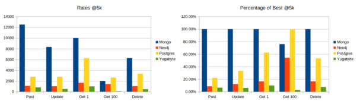
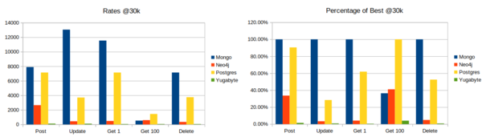

## Test Results

**Test the suitability of these prototypes.**

Based on our performance testing, we evaluated the efficiency of different database systems under various circumstances.
The results showed that in most tested scenarios, MongoDB performed the best. However, we observed a significant drop in
performance for operations that required sorting values as the number of objects grew. On the other hand, Postgres
consistently outperformed other systems for sorted selects.

As the dataset in the database increased, Postgres demonstrated significant performance improvements compared to
MongoDB. These findings indicate that Postgres is the preferred choice for large datasets, especially when the data is
structured. However, for small-scale unstructured data, MongoDB emerged as the optimal option.

To leverage these insights, we have decided to use MongoDB for caching purposes, while employing Postgres as the primary
database for long-term structured storage. This approach allows us to capitalize on MongoDB's strengths for small-scale
unstructured data while utilizing Postgres for its superior performance with large datasets and sorting operations.

In contrast, Neo4j consistently exhibited lower performance, particularly as the dataset size grew. It became apparent
that Neo4j is primarily suitable for scenarios that require multiple-level deep analytics and complex relationships,
which, although relevant to a potential trend system, is not currently being implemented.

| Neo4j   | Time | Completed | Rate             | | Percentage of Best |
|:--------|:-----|:----------|:-----------------|:-|:-------------------|
| Post    | 11.3 | 30000     | 2654.86725663717 | | 33.63%             |
| Update  | 60.1 | 26421     | 439.617304492512 | | 3.37%              |
| Get 1   | 60.9 | 29018     | 476.486042692939 | | 4.13%              |
| Get 100 | 50.7 | 30000     | 591.715976331361 | | 41.03%             |
| Delete  | 60.1 | 20940     | 348.419301164725 | | 4.88%              |

It's worth noting that the performance tests conducted on Yugabyte may not be directly relevant to the other three
database systems. The conditions under which Yugabyte was tested differed significantly, as it was conducted with a
remote setup, while the others were performed locally. Where appropriate, Yugabyte or a different sharded database can
be the correct choice - the benefits of sharding just have to outweigh the slower speeds.

| Yugabyte | Time | Completed | Rate             | | Percentage of Best |
|:---------|:-----|:----------|:-----------------|:-|:-------------------|
| Post     | 64.6 | 7351      | 113.792569659443 | | 1.44%              |
| Update   | 65.2 | 6831      | 104.769938650307 | | 0.80%              |
| Get 1    | 63.3 | 3511      | 55.4660347551343 | | 0.48%              |
| Get 100  | 64.5 | 3738      | 57.953488372093  | | 4.02%              |
| Delete   | 66   | 3446      | 52.2121212121212 | | 0.73%              |

These results provide valuable insights for selecting the appropriate database system based on specific requirements.
The data affirms that MongoDB is well-suited for small-scale unstructured data, while Postgres excels in managing large
datasets, particularly for operations involving sorting.