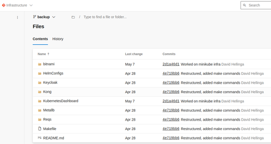
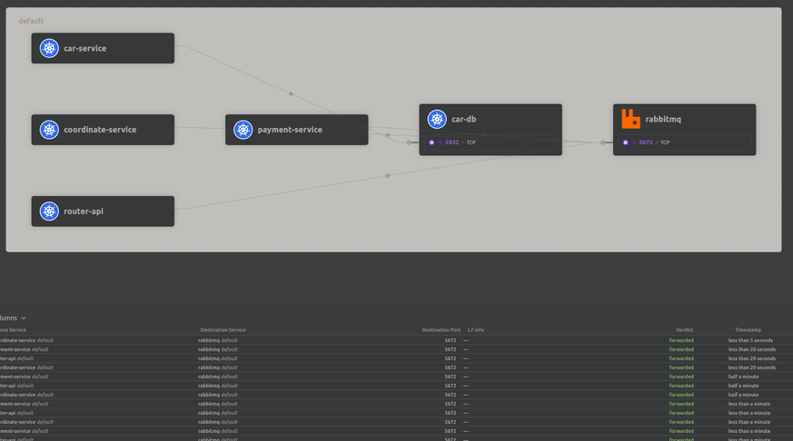

## Create prototypes for the various possible technologies within our domain.

To prototype various scalability tools for Kwetter, we explored different options and evaluated their suitability for
our requirements.

### API Gateways

We initially considered Kong as an API gateway but encountered issues with unclear documentation and limited plugin
availability in the free version. We explored other gateways but faced challenges deploying them on our local cluster
due to complexity. Eventually, we decided to use an nginx ingress with a self-made API behind it. This setup allowed us
to expose our services effectively without relying on a dedicated gateway solution.

The attempts at getting Kong to work can be found [here](https://dev.azure.com/OIBSS-F/Kwetter/_git/Infrastructure?path=%2F&version=GBbackup&_a=contents).

### Message Brokers

Considering Kwetter's requirements for asynchronous messaging and scaling without large-scale data streams, we opted for
RabbitMQ. We chose RabbitMQ because it is free, easy to use, and can be scaled using a cluster operator if needed. The
availability of MassTransit, a messaging library compatible with RabbitMQ, further supported our decision.

### Service Mesh

Initially, we encountered difficulties in setting up the cluster for Kwetter. However, we found a script that helped
automate the process of booting up the cluster with the required infrastructure for local access. We utilized the Cilium
service mesh for our cluster. Although we faced challenges early on, we were satisfied with the functionality provided
by Cilium. For future projects, more in-depth research should be conducted to ensure the best fit for specific
requirements.

