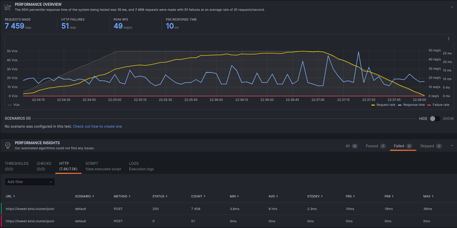

## Test the suitability of these prototypes and combinations of these prototypes.

We used k6 tests to verify the suitability of the chosen scaling technologies for use in Kwetter. Here's how we utilized
k6 tests to assess the performance, scalability, and reliability of the technologies:

1. Test Scenarios Design: We designed test scenarios that simulated realistic usage patterns and load conditions on the
   Kwetter system. These scenarios covered various user interactions, such as posting kweets, retrieving timelines, and
   searching for users. We ensured that the test scenarios encompassed both normal and peak load conditions.

2. Load Generation: We employed k6, an open-source load testing tool, to generate the desired load on the Kwetter
   system. With k6, we simulated multiple virtual users concurrently accessing the system and executing the predefined
   test scenarios. This allowed us to generate controlled and reproducible loads for consistent test results.

   

3. Performance Metrics Collection: During the test execution, k6 collected performance metrics, including response
   times, throughput, error rates, and resource utilization. These metrics provided valuable insights into the system's
   behavior and performance. We analyzed these metrics to evaluate the efficiency and performance of the scaling
   technologies.

4. Scalability Assessment: We used k6 tests to assess the scalability of the chosen scaling technologies. By gradually
   increasing the load on the system, we measured how well the infrastructure and microservices scaled to handle growing
   user demand. The test results helped us determine if the system maintained acceptable performance levels, response
   times, and throughput as the load increased.

